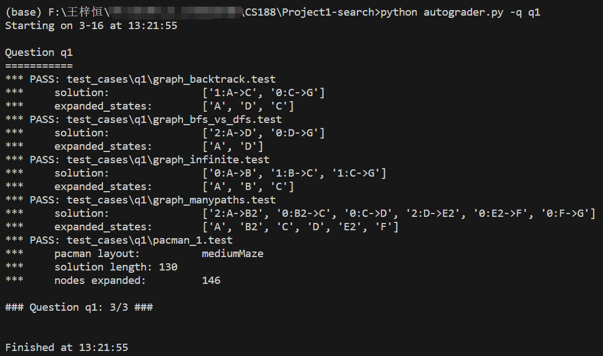
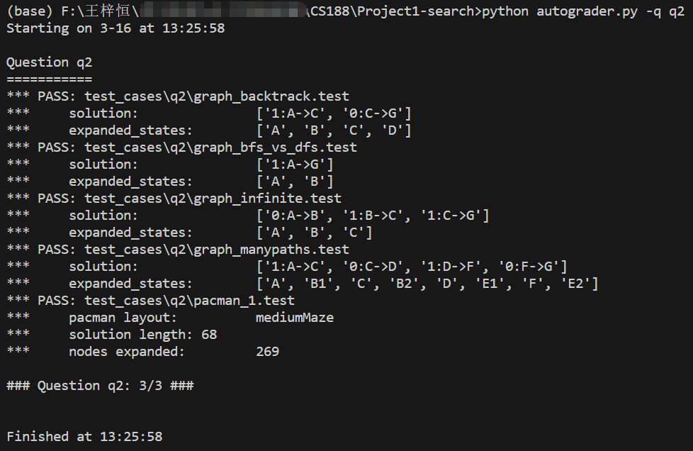
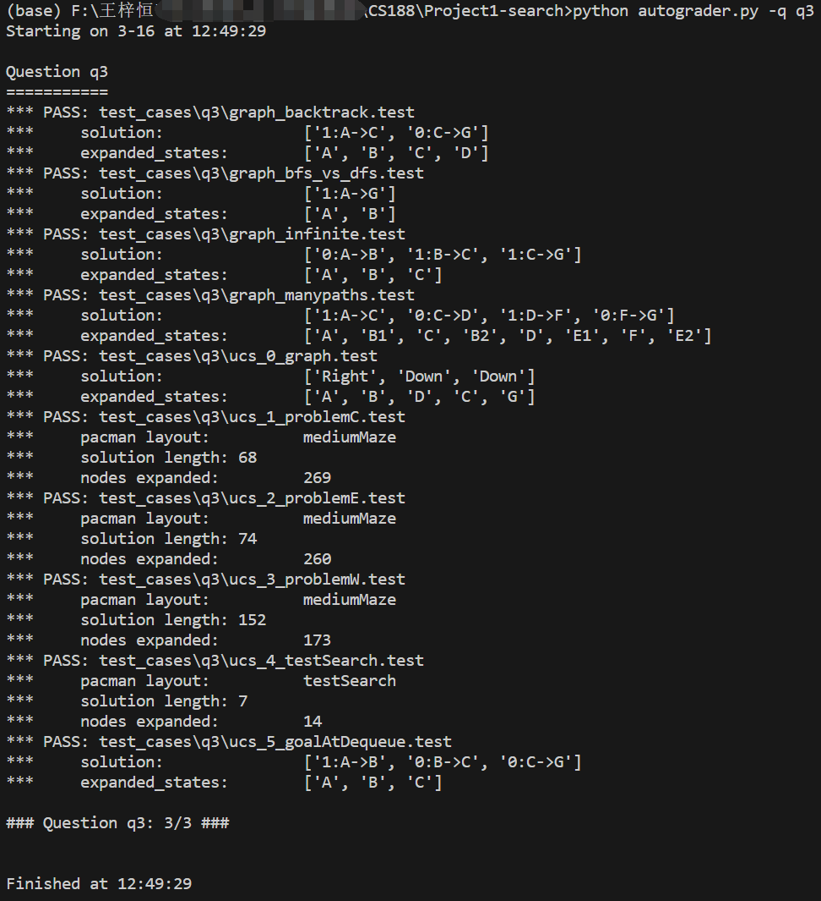
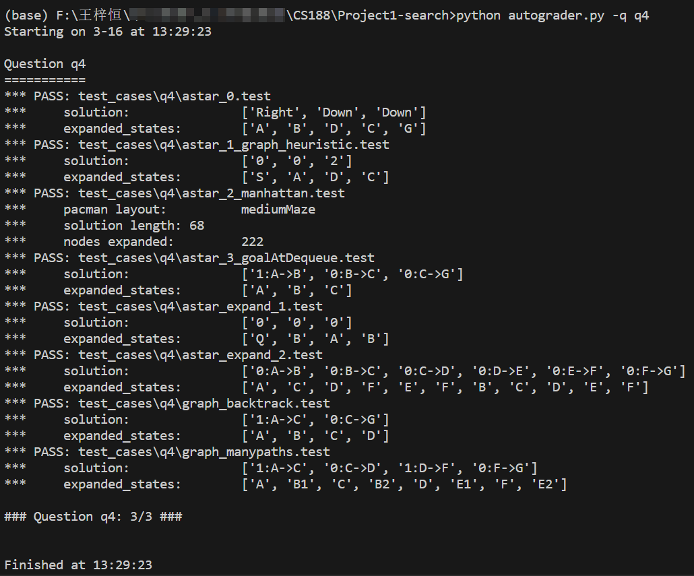

# Report for Lab01-Search

## 实验目的

1. 通过在相同的地图中运行DFS/BFS/UCS/A*四种搜索算法，验证其核心原理（深度优先、广度优先、代价优先、启发式引导）在图搜索中的行为差异
2. 观察四种算法给出路径的颜色深浅和cost大小，巩固对四种算法各自特点及优劣的宏观理解，尝试总结归纳不同策略的适用场景

3. 在独立进行代码实现的过程中加深对四种算法技术细节的底层理解

## 实验内容

### 算法简介

**DFS**：边界使用栈结构，深度方向优先探索，可能次优解

**BFS**：边界使用队列结构，层级扩展，保证最短步数解

**UCS**：边界使用优先队列，按实际路径代价排序，保证最小代价解

**A***：边界使用优先队列，综合实际代价与启发式估计（f(n)=g(n)+h(n)），高效逼近最优解

### 地图描述

**类型**：CS188使用的autograde程序使用拓扑图测试，最终展示实验结果使用的是栅格地图.lay文件

**结构**：拓扑图由边和节点构成，使用大写字母表示节点，使用 ‘/’ ‘-’ ‘>’ '<'等符号来表示边及其方向

​            栅格地图含障碍物（`%`符号）、起点（`P`）与目标点（`.`）

**权重**：标准迷宫的边移动代价统一为1，测试例中的拓扑图边移动代价可自定义


### 实验任务

在相同地图中分别运行四种算法，记录**路径总代价、拓展节点数、运行时间**，并绘制柱状图进行直观比较

## 实验过程

### 执行流程伪代码

通过课上的学习不难发现，这四种算法的实现都有着相同的框架，因此先写出通用伪代码梳理思路

```python
获得起点，构建只含有起点的第一个路径
初始化边界容器，先加入只含起点的路径
while 容器非空:
    从容器中取出一个路径作为当前路径
    若路径中的最新点为目标节点，return该路径对应的行动列表
    遍历邻居节点：
        若这个节点满足某一条件：
        	更新当前路径的坐标列表、行动列表、行动代价形成一个新路径
        	将新路径加入容器
return [] # 运行到这一行说明没有找到目标节点，没有形成有效路径，返回空列表
```

作几点解释：1. `utils.Path` 这个类的有三个成员变量`locations/actions/cost`，前两者为列表，分别存储这个路径走过的所有节点坐标和对应的行动  2. 边界容器中存储的是***边界路径***，而每个边界路径的`locations` 列表中的最后一个节点就是***边界节点***

其中最重要的，也是四种算法中差异最大的部分在于==边界容器的选择==、==决定探索到新节点后是否加入当前路径的判断条件==、==构建新路径时行动代价的更新方式==

### 算法实现细节

#### DFS

DFS的核心思路是**深度优先**，因此使用**栈结构**存储边界路径，即后探索到的路径优先取出来讨论

```python
start = problem.getStartState()
path = util.Path([start],[],0)     
fringe = util.Stack()
fringe.push(path)
```

而DFS只需要避免循环情况，即同一条路径上反复拓展到已拓展过的点，故判断条件为：

```python
if new_node in current_path.locations: continue
```

#### BFS

BFS的核心思路是**广度优先**，因此使用**队列结构**存储边界路径，即先探索到的路径先取出来讨论

```python
start = problem.getStartState()
path = util.Path([start],[],0)
fringe = util.Queue()
fringe.push(path)
```

由于BFS广度优先的核心思路，其最终选择的解一定是最浅层的，也就是吃豆人走的步数最少的（注意并不一定是cost最小的）

当从队列中pop出一条路径进行拓展时，假设此路径的最终节点为A，拓展到了B节点，但**B节点在之前讨论的路径中已经拓展过了**，这说明**此路径一定不是到达B节点的步数最少的路径**，可以直接舍弃此路径并不以其为基础添加新的path

因此使用一个键为节点坐标元组，值为表示是否被访问过的布尔值的字典来对所有探索过的节点进行标记

```python
visited = {start:True} # 用来存储访问过的节点
if problem.isGoalState(current_node): return current_path.actions # 判断条件
```

#### UCS

UCS的核心思想的**代价最小优先**，因此使用**优先级队列**结构存储边界路径，即每次都取出目前cost最小的路径讨论

```python
start = problem.getStartState()
path = util.Path([start],[],0)
fringe = util.PriorityQueue()
fringe.push(path, path.cost)
```

延用BFS中举的例子，唯一区别是**UCS要保证的是存入优先级队列中的最终节点为B节点的路径一定是目前cost最小的**，从而**保证在从B节点向外继续拓展时从起点到B的部分已经是cost最小的情况了**

当然随着探索进行，这个**”优先级队列中存储的到达B节点的cost最小路径“是可以不断更新替换的**

因此使用一个==键为节点坐标元组，值为当前探索过的路径中到达该节点的最小cost值的字典==来进行记录

```python
minCost = {start:0}  # 记录每个节点最小的代价，只有当新路径的代价更小或探索到新节点时才会更新
if new_node not in minCost or new_cost < minCost[new_node]: # 判断条件
```

#### A*

A*的核心思想为**代价+启发式函数之和最小优先**  因此在编程中有意地区分一下每一步的g（实际代价）和h（启发式代价）

因此使用**优先级队列**结构存储边界路径，即每次都取出目前cost+heauristic最小的路径讨论

```python
start = problem.getStartState()
init_g = 0
init_h = heuristic(start, problem)
path = util.Path([start],[],init_g)
fringe = util.PriorityQueue()
fringe.push(path, init_g+init_h)
```

与UCS的思路完全一致，我们需要一个字典来**保证存入优先级队列中的最终节点为B节点的路径一定是目前cost最小的**，这一步的目标是**保证到达B的实际cost也就是g最小，而不是g+h最小**，所以要注意和存入优先级队列时的g+h区别（笔者就是因为这个错误debug了很久）

```python
# 记录每个节点最小的代价，保证到当前节点的路径是实际cost(也就是g)最小的
minCost = {problem.getStartState():0}

for successor in problem.getSuccessors(current_node):
    new_node = successor[0]
    new_action = successor[1]
    new_g = current_g + successor[2]
    new_h = heuristic(new_node, problem)

    if new_node not in minCost or new_g < minCost[new_node]: # 判断条件
        minCost[new_node] = new_g
        new_nodes = current_path.locations[:]
        new_nodes.append(new_node)
        new_actions = current_path.actions[:]
        new_actions.append(new_action)
        path = util.Path(new_nodes, new_actions, new_g) # 构建Path类只用g
        fringe.push(path, new_g+new_h) # 存入fringe要用g+h
```


## 实验代码与结果

#### 代码

```python
# DFS
def depthFirstSearch(problem, max_depth=-1):
    """Search the deepest nodes in the search tree first."""
    start = problem.getStartState()
    path = util.Path([start],[],0)     
    fringe = util.Stack()
    fringe.push(path)
    
    while not fringe.isEmpty():

        current_path = fringe.pop()
        current_node = current_path.locations[-1]
        current_cost = current_path.cost

        if problem.isGoalState(current_node): return current_path.actions
        else:
            for successor in problem.getSuccessors(current_node):
                new_node = successor[0]
                new_action = successor[1]
                new_cost = current_cost + successor[2]

                if new_node in current_path.locations: continue # 判断条件
                else:
                    new_nodes = current_path.locations[:]
                    new_nodes.append(new_node)
                    new_actions = current_path.actions[:]
                    new_actions.append(new_action)
                    path = util.Path(new_nodes, new_actions, new_cost)
                    fringe.push(path)
    return []
```

```python
# BFS
def breadthFirstSearch(problem):
    """Search the shallowest nodes in the search tree first."""
    start = problem.getStartState()
    path = util.Path([start],[],0)
    visited = {start:True} # 用来存储访问过的节点
    fringe = util.Queue()
    fringe.push(path)

    while not fringe.isEmpty():
        current_path = fringe.pop()
        current_node = current_path.locations[-1]
        current_cost = current_path.cost
	
        if problem.isGoalState(current_node): return current_path.actions 
        else:
            for successor in problem.getSuccessors(current_node):
                new_node = successor[0]
                new_action = successor[1]
                new_cost = current_cost + successor[2]

                if not visited.get(successor[0], False): # 判断条件
                    visited[successor[0]] = True
                    new_nodes = current_path.locations[:]
                    new_nodes.append(successor[0])
                    new_actions = current_path.actions[:]
                    new_actions.append(successor[1])
                    path = util.Path(new_nodes, new_actions, new_cost)
                    fringe.push(path)
    return []
```

```python
# UCS
def uniformCostSearch(problem):
    """Search the node of least total cost first."""
    start = problem.getStartState()
    path = util.Path([start],[],0)
    # 记录每个节点最小的代价，只有当新路径的代价更小或探索到新节点时才会更新
    minCost = {start:0}     
    fringe = util.PriorityQueue()
    fringe.push(path, path.cost)
    
    while not fringe.isEmpty():
        
        current_path = fringe.pop()
        current_node = current_path.locations[-1]
        current_cost = current_path.cost

        if problem.isGoalState(current_node): return current_path.actions
        else:
            for successor in problem.getSuccessors(current_node):
                new_node = successor[0]
                new_action = successor[1]
                new_cost = current_cost + successor[2]
				
                # 判断条件
                if new_node not in minCost or new_cost < minCost[new_node]: 
                    minCost[new_node] = new_cost
                    new_nodes = current_path.locations[:]
                    new_nodes.append(new_node)
                    new_actions = current_path.actions[:]
                    new_actions.append(new_action)
                    path = util.Path(new_nodes, new_actions, new_cost)
                    fringe.push(path, path.cost)
    
    return []
```

```python
# A*
def aStarSearch(problem, heuristic=manhattanHeuristic2):
    """Search the node that has the lowest combined cost and heuristic first."""
    start = problem.getStartState()
    init_g = 0
    init_h = heuristic(start, problem)
    path = util.Path([start],[],init_g)
    # 记录每个节点最小的代价，保证到当前节点的路径是实际cost(也就是g)最小的
    minCost = {problem.getStartState():0}
    fringe = util.PriorityQueue()
    fringe.push(path, init_g+init_h)
    
    while not fringe.isEmpty():
        
        current_path = fringe.pop()
        current_node = current_path.locations[-1]
        current_g = current_path.cost

        if problem.isGoalState(current_node): return current_path.actions
        for successor in problem.getSuccessors(current_node):
            new_node = successor[0]
            new_action = successor[1]
            new_g = current_g + successor[2]
            new_h = heuristic(new_node, problem)

            if new_node not in minCost or new_g < minCost[new_node]: # 判断条件
                minCost[new_node] = new_g
                new_nodes = current_path.locations[:]
                new_nodes.append(new_node)
                new_actions = current_path.actions[:]
                new_actions.append(new_action)
                path = util.Path(new_nodes, new_actions, new_g)
                fringe.push(path, new_g+new_h)
    
    return []
```

#### 实验结果

首先四种算法实现都通过了CS188的全部测试集  q1-q4分别对应DFS/BFS/UCS/A*

<div align="center">
    
    
    
    
</div>


然后对四种算法在同一地图中的表现进行分析，重点关注***Cost，Expanded Nodes，Time***三个指标

其中***Cost***为该算法最终选择的路径的总代价；***Expanded Nodes***为调用`getSuccessors()`函数的次数，即图形化界面中有被白色/红色覆盖的格子数量；***Time***为程序计算出最终选择的路径所需的时间，而非吃豆人在迷宫中行走到终点所需的时间

##### TinyMaze

| Algorithm | Cost | Expanded Nodes |  Time   |
| :-------: | :--: | :------------: | :-----: |
|    DFS    |  10  |       15       | 0.00100 |
|    BFS    |  8   |       15       | 0.00100 |
|    UCS    |  8   |       15       | 0.00103 |
|    A*     |  8   |       14       | 0.00251 |

##### MediumMaze

| Algorithm | Cost | Expanded Nodes |  Time   |
| :-------: | :--: | :------------: | :-----: |
|    DFS    | 124  |      140       | 0.00300 |
|    BFS    |  62  |      242       | 0.00436 |
|    UCS    |  62  |      242       | 0.00350 |
|    A*     |  62  |      204       | 0.00399 |

##### BigMaze

| Algorithm | Cost | Expanded Nodes |  Time   |
| :-------: | :--: | :------------: | :-----: |
|    DFS    | 210  |      390       | 0.00798 |
|    BFS    | 210  |      620       | 0.00927 |
|    UCS    | 210  |      620       | 0.00898 |
|    A*     | 210  |      549       | 0.00776 |

#### 分析与结论

1. **DFS**不一定能找到最优解（cost最小的解），**不具备最优性**
2. 这三张图都是**cost全部为1**，因此**BFS每张图中都能找到最优解**，但**当不同边的cost不同时BFS就不一定能找到最优解**了（本来想改源码试着设计一个这样的实验的，但迫于时间有限未能完成）
3. **UCS和A\***一定能找到最优解，**具有最优性**，但**后者比前者探索的节点数更少，理论上时间性能更优**
4. 补充上一点，A*具有最优解的前提是设计的启发式函数具有**可纳性和一致性**
5. 从Time数据来看，UCS和A*的最优性一定程度上是以计算时间为代价的，而在BigMaze中DFS也”碰巧“找到了最优路径，并且探索的节点是最少的，所以当我们知道迷宫的具体形状和起终点位置时，可以考虑使用一些”讨巧“的办法用最小的代价找到最优解
