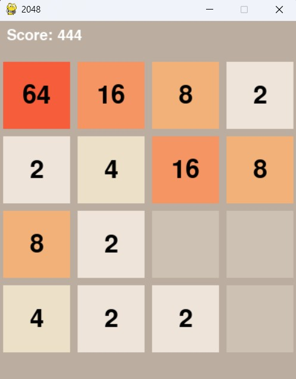
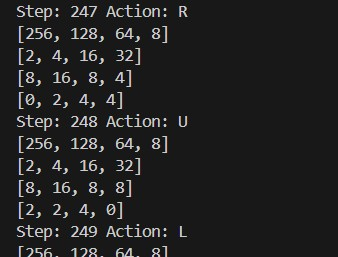

# Coding Work #3

## HOWTOs
**Q: How to run the python code?**

**A:** You can use any PYTHON_ENV + IDE you preferred.
My recommendation is Anaconda + VSCODE/PyCharm


**Q: How to run this project?**

**A:** See below.

**Q: How to resolve "ModuleNotFoundError: No module named 'pygame'"**

**A:** You can use conda or pip to install this package. For example:
```bash
pip install pygame
```
You can also install pygame via the Package Manager in Pycharm. For any missing modules, you can use pip or conda to install.

----------------------------------------------------------------------
You can always run your code with the following command or add it to the configuration in your IDE
```bash
python game_player.py --agent AGENT_NAME --max GAME_MAX_VAL --rounds GAME_ROUNDS --ui
```

AGENT_NAME is the agent to play the game, you can choose:
```bash
random
simpleheuristic
expectimax

```
We have implemented the RamdomAgent and SimpleHeuristicAgent for you. 

**Please implement the ExpectimaxAgent and RolloutAgent by yourself.**

GAME_MAX_VAL is the maximum to reach. For example, GAME_MAX_VAL=2048 is the standard 2048 game. You can reduce it to 512 or 1024 to test your algorithm since it may take a long time to win 2048.

GAME_ROUNDS is the number of rounds to play [Default=1]. You can increase GAME_ROUNDS to larger numbers.

We also implemented a GUI for 2048 game. If you add "--ui" in args, we can see a GUI as follows:


If you dont add "--ui" in args, you may only see the game board in terminals as follows:


----------------------------------------------------------------------
## About the agents
We have implemented two agents for you. All agents are subclasses of BaseAgent. **For RandomAgent, the action is randomly selected from the possible candidates. For SimpleHeuristicAgent, we just select the action which can lead to the state with largest heuristic value.** Please carefully read the code of RandomAgent and SimpleHeuristicAgent. 

==**Your task is to implement the function "_get_action" in ExpectimaxAgent and RolloutAgent. **==MCTSAgent is a bonus. You can also add your own member methods and functions.

### ExpectimaxAgent

2048 Game is challenging. It is difficult to reach the terminal state based on standard Expectimax Tree. **Therefore, we have to use the heuristic function to evaluate the quality of non-terminal states. **

One idea is to put the largest number at the corner. You may find the definition of WEIGHT in agent/heuristic.py
```python
WEIGHT1 = [[4**6, 4**5, 4**3, 4**2],[4**5, 4**4,4**3,4**2],[4**4, 4**3, 4**2, 4**1],[4**3, 4**2, 4**1, 4**0]]
```
You can also write your own heuristic function to better evaluate the game.

### About the Game
There are some useful functions in class Game2048.
```python
get_valid_actions() # Possible actions [U/D/L/R] based on current state
get_state() # Get current state
set_state(state) # Set current state 
set_action(action) # Set [U/D/L/R] to move
forward_player_only() # Run the action and merge the values
add_random_tile() # Add 2 or 4 at random empty cell
get_valid_successors() # Get the possible successor states and the probability

```
For more class members and functions, please read the code of Game2048 (game/game.py).

----------------------------------------------------------------------
Please upload all files in your project in a compressed package (*.zip) to canvas.
You can write your code in directory: "agent/"

----------------------------------------------------------------------
For any questions, feel free to contact with me and TAs.
We would like to thank the great efforts from UCB-CS188 teaching group. 

## GOOD LUCK AND HAVE FUN!

